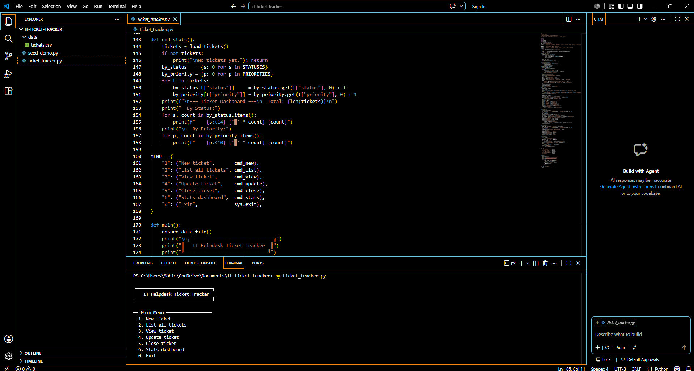
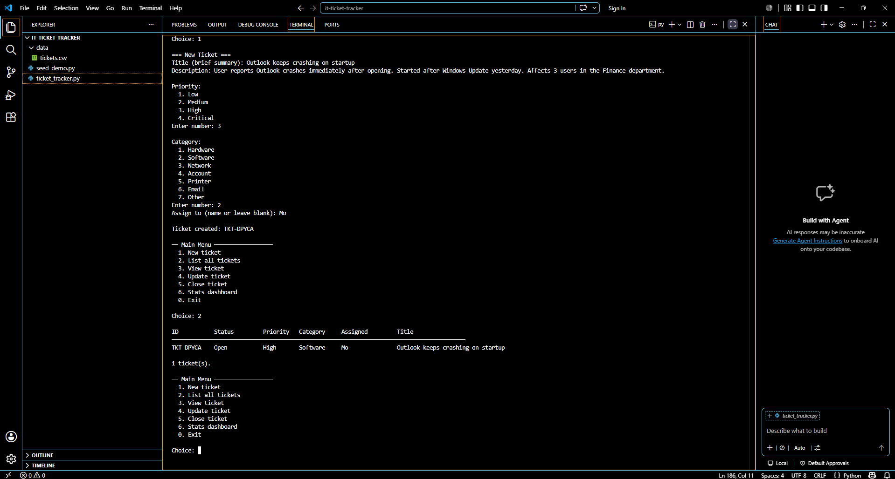
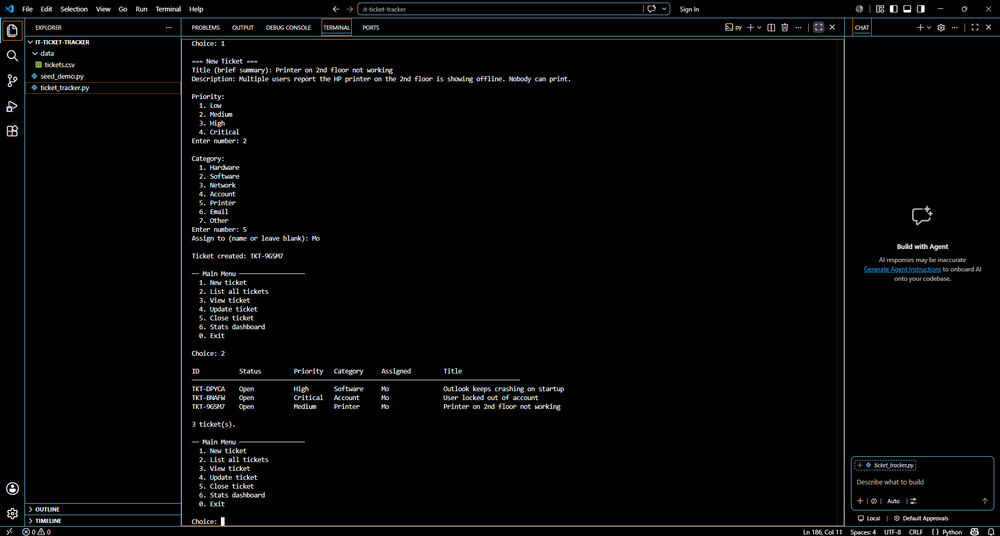
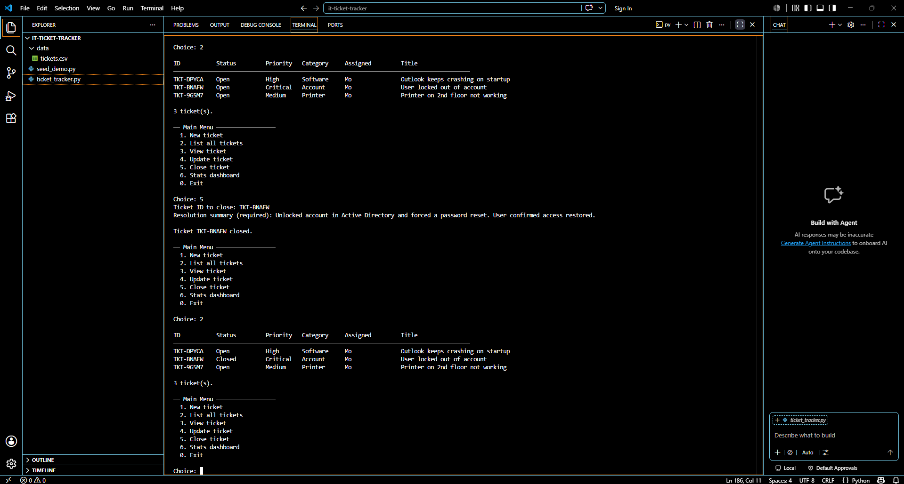
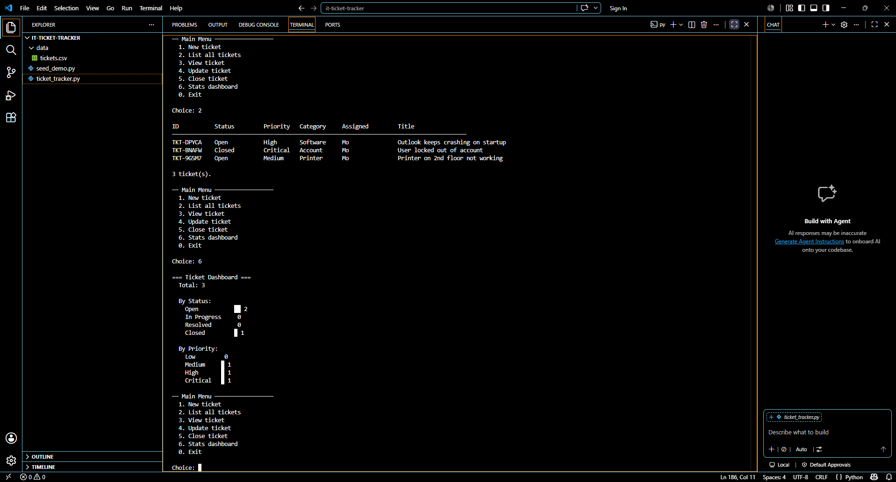

# IT Helpdesk Ticket Tracker

A command-line ticket management tool built in Python for tracking, updating, and resolving IT support requests. All ticket data is stored locally in CSV format — no database or internet connection required.

Built as part of my IT helpdesk portfolio to demonstrate practical scripting, data handling, and process automation skills.

---

## Features

- Create tickets with title, description, priority, category, and assignment
- List tickets with status and priority indicators
- View full ticket detail including description, timestamps, and resolution notes
- Update tickets — change status, reassign, or append resolution notes
- Close tickets with a required resolution summary
- Stats dashboard — visual breakdown of tickets by status and priority
- Search across title, description, category, and assignee

---

## Screenshots







---

## How to Run

```bash
python ticket_tracker.py
```

---

## What I Learned

- Designing a CLI application around real IT helpdesk workflows
- Managing persistent data with Python's csv module
- Structuring code with modular functions for readability
- Building a tool that mirrors real helpdesk software like Zendesk and Freshdesk
